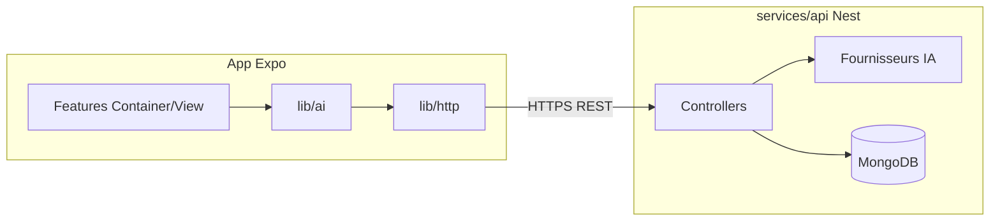

# Architecture du dépôt — WaterYouPlant / plantApp

## Objectifs

- **Scalabilité** : front isolé, contrats API explicites, clients HTTP et IA remplaçables.
- **APIs IA** : aucune clé secrète dans l’app mobile ; les appels passent par le futur backend (Nest) qui agrège les fournisseurs IA, quotas et validation.
- **Nest (plus tard)** : le code serveur vivra sous `services/api/` ; les types partagés en phase 1 restent dans `src/shared/contracts/` (puis éventuellement package npm ou génération OpenAPI).

## Arborescence cible

```text
plantApp/
├── app/                    # Expo Router — routes uniquement (fins), branche vers les features
├── src/
│   ├── core/               # Config globale, bootstrap (QueryClient, thème global, etc.)
│   ├── shared/             # Transversal sans logique métier lourde
│   │   ├── constants/
│   │   └── contracts/      # Formes JSON / DTO alignées sur les futurs contrôleurs Nest
│   ├── lib/                # Intégrations techniques (HTTP, IA, analytics…)
│   │   ├── http/
│   │   └── ai/
│   ├── features/           # Par domaine produit (home, journal, …) — Container / View
│   ├── components/         # UI réutilisable
│   ├── hooks/              # Hooks UI / thème (pas de fetch métier ici si évitable)
│   └── theme/
├── services/
│   └── api/                # Emplacement réservé pour l’app NestJS (vide pour l’instant)
├── docs/
│   └── architecture.md
└── assets/
```

## Flux données (IA + API)



## Règles rapides

| Zone | Rôle |
|------|------|
| `app/` | Composition de routes ; pas de logique métier. |
| `features/*/screens/*-container.tsx` | Orchestration, état local, appels hooks services. |
| `features/*/screens/*-view.tsx` | Présentation pure. |
| `lib/http` | Tout accès réseau REST vers ton API. |
| `lib/ai` | Endpoints « domaine IA » (le backend mappe vers OpenAI, etc.). |
| `shared/contracts` | Types stables pour le fil JSON ; à synchroniser avec les DTO Nest. |

## Évolution monorepo (optionnelle)

Quand Nest arrive, tu peux passer à `apps/mobile` + `apps/api` + `packages/contracts` sans changer les concepts ci-dessus ; seuls les chemins et `tsconfig` changent.

## Alias TypeScript (`tsconfig.json`)

- `@/core/*` → `src/core/*`
- `@/lib/*` → `src/lib/*`
- `@/shared/*` → `src/shared/*`
- `@/*` → `src/*` (features, components, hooks, …)
